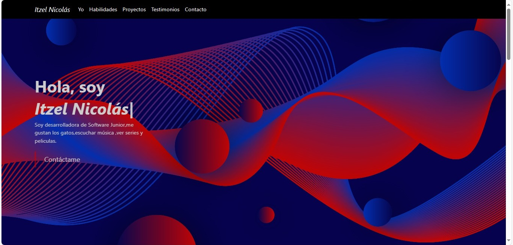
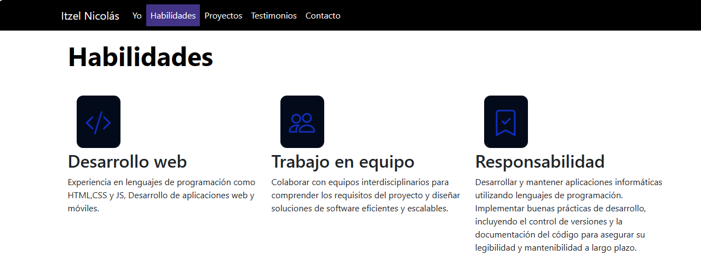
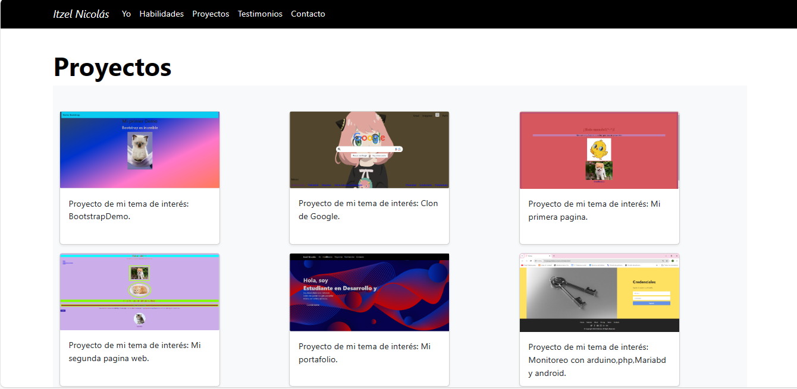
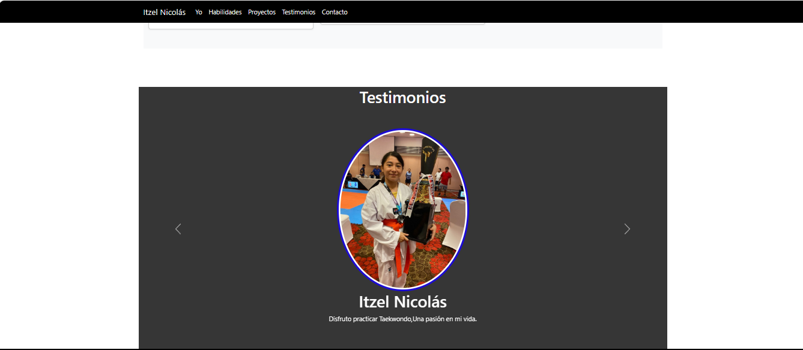

# Mi portafolio de Technolochicas PRO

Este portafolio es desarrollado para poner en práctica las habilidades obtenidas dentro del bootcamp de desarrollo frontend.

Fue desarrollado con HTML, CSS y JS con el uso de framework Bootstrap utilizando animaciones de bibliotecas externas.

[proyecto en linea ](https://astonishing-pudding-6be3d3.netlify.app/#)
- Tecnologías
 
* HTML
* CSS
* Javascript
* Bootstrap 5

- Capturas de pantalla 

- Créditos
Creado por Itzel Nicolás en el bootcamp de Technolochicas PRO.